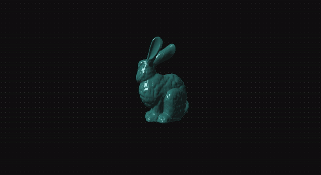
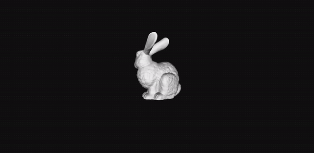

# Software Renderer (SDL + C)

A **CPU-based software renderer written in C**, using **SDL2 only for windowing and display output**.  
The project focuses on building a complete rasterization pipeline from the ground up — covering projection math, triangle rasterization, depth buffering, lighting, texture mapping, and performance optimization — before moving to GPU rendering.

This is part of an ongoing exploration into **rendering engineering / graphics programming**, coming from a VFX/film technical background.


## Demos

| Directional Light + Phong Shading | Phong Shading + Wireframe |
|:-:|:-:|
|   |   |
| Directional Light (Flat Shading) | Wireframe |
|   |   |
| Textured | Textured + Wireframe |
|   |   |
## ✨ Current Features

### Core Pipeline
- SDL2 window + renderer initialization (RGBA32 pixel format)
- CPU color buffer rendering pipeline
- Framebuffer clearing and presentation
- Locked 60 FPS frame timing with event-driven input handling
- Delta time implementation to decouple simulation speed from frame rate

### Geometry & Mesh
- Mesh and triangle data types with dynamic arrays for complex geometry
- OBJ file loader — reads arbitrary meshes from disk
- Multi-mesh scene support — load and render multiple meshes with independent transforms and textures
- Per-mesh scale, translation, and rotation properties
- Stanford Bunny included as default test mesh (~70k triangles)
- Per-face and per-triangle color support

### Transformations
- Full matrix-based transformation pipeline
- Scale, rotation (per-axis), and translation matrices
- World matrix combining all transforms (matrix-to-matrix multiplication)
- NDC / projection matrix
- Object → world → screen space pipeline with correct Y-axis orientation

### Camera
- Camera class with look-at matrix model
- FPS-style movement controls (WASD + up/down)
- Yaw controls (rotate left/right)
- Pitch controls (look up/down)
- Camera frustum planes for clipping
- Refactored camera and light into dedicated modules with clean getter/setter interfaces

### View Frustum Clipping
- Camera frustum plane initialization
- Polygon-based vertex clipping against all frustum planes
- Triangle ↔ polygon conversion for clipping pipeline
- Polygon reconstruction into triangles after clipping
- UV interpolation preserved correctly through clipping

### Rendering Modes (interactive toggle)
- Wireframe + vertex rendering (vertices highlighted as red squares)
- Wireframe only
- Filled flat-shaded triangles
- Wireframe + filled combined
- Textured
- Textured + wireframe combined
- Phong shading with specular highlights
- Phong shading + wireframe combined

### Rasterization
- Line drawing (screen-space)
- Triangle wireframe rendering
- Filled triangle rasterization (flat-top / flat-bottom split)
- Slope-based scanline fill with divide-by-zero safeguards

### Backface Culling
- Vector math (cross product, dot product, normals)
- Backface culling with interactive toggle between culling modes

### Depth Buffering
- Per-pixel Z-buffer implementation for correct depth testing (replaces painter's algorithm)
- Z-buffer applied to both textured and non-textured rendering paths
- Static maximum triangle buffer (no dynamic allocation per frame)

### Lighting
- Directional light source
- Flat shading — per-face light intensity based on surface normal alignment
- Phong shading — per-pixel lighting with smooth normal interpolation
- Phong reflection model — ambient, diffuse, and specular components
- Per-mesh material system (ka, kd, ks, shininess)
- White specular highlights independent of object color
- Face normal calculation refactored into the graphics pipeline for clarity and correctness

### Texture Mapping
- PNG texture loading via the `upng` library (minimal, dependency-free)
- UV coordinates loaded directly from OBJ files
- V coordinate inversion to account for OBJ top-left UV origin
- UV coordinate interpolation using barycentric weights
- Perspective-correct UV mapping (perspective divide)
- Safeguards for degenerate pixels during perspective divide

---

## 🧠 Concepts Covered

### Software Rendering Pipeline
- Manual color buffer allocation and management
- CPU raster operations and framebuffer presentation
- CPU → GPU texture upload via SDL

### 3D Math
- Perspective projection: `x' = (fov * x) / z`, `y' = (fov * y) / z`
- Camera offset handling to avoid division by zero
- Screen-space coordinate transforms
- Matrix math: scale, rotation, translation, world, projection, look-at (view matrix)
- Vector math: cross products, dot products, surface normals
- Barycentric coordinate interpolation for UV mapping and normal interpolation
- Perspective divide for correct texture projection
- Frustum plane equations and vertex clipping (Sutherland-Hodgman style)
- Phong reflection model: ambient + diffuse + specular
- Reflection vector computation: R = 2(N·L)N - L
- Per-pixel normal interpolation for smooth shading

### Image Processing
- PNG decoding and pixel format handling (RGBA32)
- UV space to texel space mapping
- Perspective-correct interpolation across triangle surfaces

### Performance
- World and view matrices combined into a single `world_view_matrix` — halves matrix multiplications per vertex
- Face count cached before the render loop to avoid repeated `array_length` calls
- Static triangle buffer (no dynamic allocation per frame)
- Compiler optimisation via `-O2` flag in Makefile
- Mesh-level frustum check — skips per-face clipping entirely when mesh is fully inside the frustum
- Fast path for non-clipped triangles — projects directly without polygon conversion overhead
- Tight raster loops to minimise unnecessary iteration
- Frame timing and event loop responsiveness

---

## ⚙️ Build Requirements

- C compiler (GCC / Clang recommended)
- SDL2 development libraries

### Linux / macOS:
```bash
make build
./renderer
```

The Makefile compiles with `-O2` optimisations enabled. For a debug build without optimisations:
```bash
gcc -Wall -std=c99 ./src/*.c -lSDL2 -lm -o renderer
```

### Prebuilt Binary
A prebuilt Linux binary is included in the repo if you want to run without compiling:
```bash
./renderer
```

---

## 🚀 Running

```bash
./renderer
```

### Controls

| Key | Action |
|-----|--------|
| `1` | Wireframe + vertices |
| `2` | Wireframe only |
| `3` | Filled triangles (flat shading) |
| `4` | Wireframe + filled |
| `5` | Textured |
| `6` | Textured + wireframe |
| `7` | Phong shading |
| `8` | Phong shading + wireframe |
| `C` | Enable backface culling |
| `X` | Disable backface culling |
| `W/S` | Move camera forward/back |
| `A/D` | Rotate camera yaw left/right |
| `Up/Down` | Move camera up/down |
| `J/K` | Pitch camera up/down |
| `ESC` | Exit |

---

## 📂 Project Structure

```
.
├── assets/
│   ├── bunny.obj                      # Stanford Bunny (~70k triangles)
│   ├── cube.png                       # Default texture
│   ├── demo_phong.gif                 # README demo (Phong shading)
│   ├── demo_phong_wireframe.gif       # README demo (Phong + wireframe)
│   ├── demo_lighting.gif              # README demo (flat shading)
│   ├── demo_wireframe.gif             # README demo (wireframe)
│   ├── demo_textured.gif              # README demo (textured)
│   └── demo_textured_wireframe.gif    # README demo (textured + wireframe)
├── src/
│   ├── main.c
│   ├── display.c / display.h
│   ├── vector.c / vector.h
│   ├── mesh.c / mesh.h                # Multi-mesh scene management
│   ├── triangle.c / triangle.h
│   ├── texture.c / texture.h
│   ├── light.c / light.h
│   ├── camera.c / camera.h
│   ├── clipping.c / clipping.h
│   ├── matrix.c / matrix.h
│   ├── material.c / material.h        # Per-mesh Phong material properties
│   ├── array.h                        # Dynamic array implementation
│   └── upng.c / upng.h                # Minimal PNG decoding library
├── renderer                           # Prebuilt Linux binary
├── Makefile
└── README.md
```

---

## 🛠 Known Limitations

- No mesh instancing
- CPU only — no GPU acceleration

These are intentional at this stage. The goal is to understand every part of the pipeline before moving to a GPU-based implementation.

---

## 🎯 Planned Next Steps

### Rendering Features
- Dithered NPR rendering mode
- Mesh instancing

### Performance
- SIMD optimisations
- Multithreaded rasterization

### Graphics Programming Progression
- Software renderer → OpenGL pipeline transition
- Shader experimentation (GLSL)
- Physically-based shading concepts

---

## 💼 Why This Project Exists

Coming from a **VFX/film lighting & compositing technical background**, this project builds low-level graphics foundations toward a transition into:

- Rendering engineering
- GPU graphics programming
- Real-time NPR / stylized rendering pipelines

Understanding the CPU renderer demystifies GPU pipelines and shader math from first principles.

---

## 📚 Learning Sources

- Pikuma graphics programming courses
- Classic software renderer tutorials
- Real-time rendering literature
- [upng](https://github.com/elanthis/upng/) — minimal PNG decoding library by elanthis
